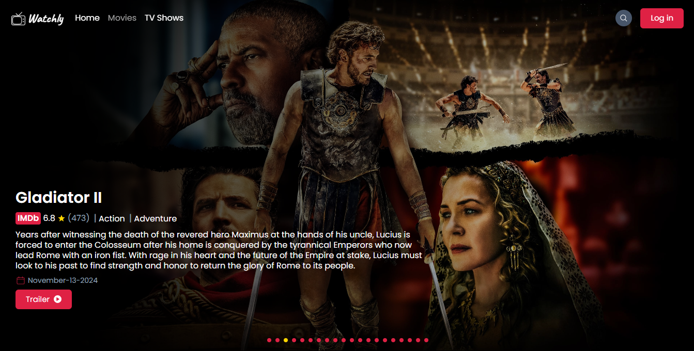

# 🎬 Watchly


🌐 [Demo](https://watchly-app.vercel.app/)

<div align="center">
    
</div>

## Description

Watchly is your personal movie and TV series companion. Discover trending content, browse by genres, and search for your favorites. Create an account to save movies to your favorites and watchlist, manage your profile, and get instant feedback with toast notifications. Watch trailers in a sleek modal player and enjoy a fully responsive experience on any device.

## Key Features

- **🔐 User Authentication**: Secure login and registration with password encryption.
- **❤️ Favorites & Watchlist**: Save your favorite movies and series, and create a watchlist for later.
- **👤 User Profile**: Update your display name, change password, and manage your account.
- **🎥 Popular Titles**: Discover trending movies and series on the homepage.
- **🔍 Search Functionality**: Quickly find movies and series by name.
- **🎞️ Trailers in Mini Player**: Watch trailers in a sleek, responsive modal.
- **🗂️ Genre Browsing**: Explore content by genres with dedicated pages.
- **📜 Infinite Scrolling**: Browse content seamlessly with endless scrolling.
- **📄 Pagination**: Navigate content effortlessly with paginated sections.
- **📑 Detailed Pages**: Access detailed information about individual movies and series.
- **🔔 Toast Notifications**: Get instant feedback for all your actions.
- **📱 Fully Responsive**: Enjoy Watchly on any device—desktop, tablet, or mobile.

## Installation

1. Clone the project 👇

```bash
git clone git@github.com:ab-sharifi21/watchly.git
```

2. Install the dependencies 👇

```bash
npm install
```

3. Copy the contents of .env.example to .env.local 👇

```bash
cp .env.example .env.local
```

4. Run the app with 👇

```bash
npm run dev
```

5. To access the app open you browser and go to 👇

```bash
http://localhost:3000
```

## Technologies

- TypeScript
- React.js
- Next.js
- TailwindCSS
- NextAuth.js
- Prisma
- PostgreSQL (Neon)
- bcryptjs
- react-hot-toast
- CSS
- HTML
- TMDB API
